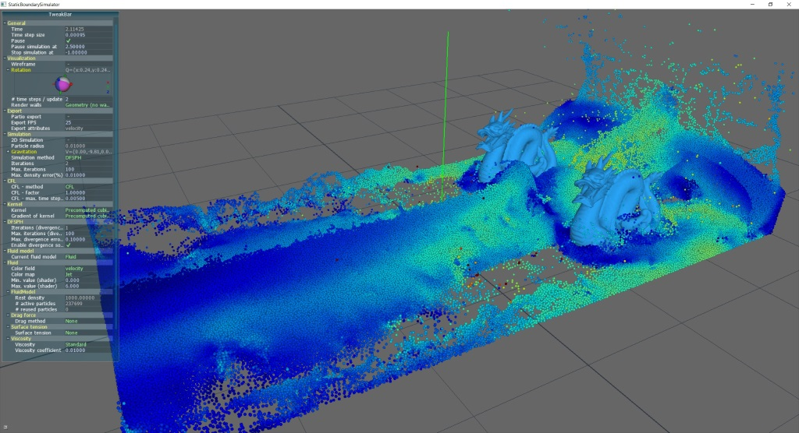

# cuNSearch
A C++/CUDA library to efficiently compute neighborhood information on the GPU for 3D point clouds within a fixed radius. Suitable for many applications, e.g. neighborhood search for SPH fluid simulations.

The library interface is similar to the CPU neighborhood search [CompactNSearch](https://github.com/InteractiveComputerGraphics/CompactNSearch).
## Libraries using cuNSearch

* [SPlisHSPlasH](https://github.com/InteractiveComputerGraphics/SPlisHSPlasH) - A C++ library for the physically-based simulation of fluids using Smoothed Particle Hydrodynamics (see screenshot)

	

## Build Instructions

This project is based on [CMake](https://cmake.org/). Simply generate project, Makefiles, etc. using [CMake](https://cmake.org/) and compile the project with the compiler of your choice.

Requirements:
- CMake 3.12
- CUDA SDK 9.0 or newer
- C++ 11

The code was tested with the following configurations:
- Windows 10 64-bit, CMake 3.12.3, Visual Studio 2017, CUDA SDK 10.1
- Debian 9 64-bit, CMake 3.12.3, GCC 6.3.0, CUDA SDK 9.2


## Usage
A data structure to perform a neighborhood search can be created by calling the constructor given a fixed search radius ```r```.
```c++
cuNSearch::NeighborhoodSearch nsearch(r);
```
An arbitrary number of point clouds can then be added to the data structure using the method ```add_point_set```. The library expects the point positions to be contiguously stored in an array-like structure. The method will return a unique id associated with the initialized point set.
```c++
std::vector<std::array<Real, 3>> positions;
// ... Fill array with 3 * n real numbers representing three-dimensional point positions.
unsigned int point_set_id = nsearch.add_point_set(positions.front().data(), positions.size());
nsearch.find_neighbors();
```
In order to generate the neighborhood information simply execute the following command
```c++
nsearch.find_neighbors();
```
Finally, the neighborhood information can be accessed as follows
```c++
PointSet const& ps = nsearch.point_set(point_set_id);
for (int i = 0; i < ps.n_points(); ++i)
{
	for (int j = 0; j < ps.n_neighbors(i); ++j)
	{
    	// Return PointID of the jth neighbor of the ith particle in the 0th point set.
	    PointID const& pid = ps.neighbor(0, i, j);
	    // ...
	    // Do whatever you want with the point id. The id contains two indices.
	    // The first field pid.point_set_id represents the unique point set id returnd by add_point_set.
	    // The second field pid.point_id stands for the index of the neighboring particle within
	    // the containing point set.
	    // ...
	}
}
```

Besides the basic functionality the library offers to compute a rule for reordering the points according to a space-filling Z curve. The reordering will improve the performance of future neighborhood queries and accesses. The rule can be computed via
```c++
nsearch.z_sort();
```
Please note that the actual reordering must be invoked by the user by
```c++
ps.sort_field(positions.data());
```
Assuming that there is additional information stored per-point (e.g. velocity, color, mass etc.) the information **must** also be reorded using the same method to maintain consistency. Subsequently, the ```find_neighbors``` function has to be invoked again to update the neighborhood information.

Another self-explaining (benchmark) [demo](demo/main.cu) is contained in the project.

## Activation Table

When maintaining multiple it is sometimes desired that only certain point sets can find points from other point sets. Therefore an activation table is implemented where the user can specify whether a point set i searches points in another point set j. When nothing else is specified all point sets will search points in all other point sets. The activation table can be modified with e.g.
```c++
nsearch.set_active(i, j, false)
```

## Common mistakes and issues

Visual Studio may not detect changes in ".cu" files.

Use of thrust library in cpp files: Some thrust classes can only be used when the file is compiled by the nvidia compiler nvcc.
This is usually solved by change the file ending to .cu to mark the file for the nvcc compiler.

## References

* R. Hoetzlein, 2014. "Fast Fixed-Radius Nearest Neighbors: Interactive Million-Particle Fluids", GPU Technology Conference (GTC), Santa Clara, CA.
